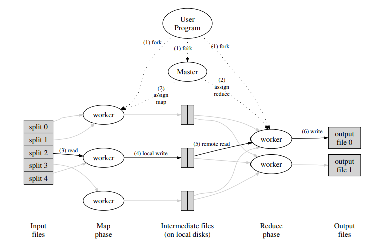

paper [link](https://static.googleusercontent.com/media/research.google.com/en//archive/mapreduce-osdi04.pdf)
# 1.介绍
MapReduce 是一种用于处理和生成大规模数据集的编程模型。它将数据处理分为两个主要阶段：Map 和 Reduce，从而实现对大数据的并行计算和分布式处理。MapReduce的设计目标是能够在计算机集群上高效处理TB级甚至PB级的数据集。
# 2.编程模型
例如大型文档集合中每个单词出现次数的问题，我们可以使用MapReduce处理，下文将默认处理该问题。
## 2.1Example
伪代码：
>map(String key, String value):
// key: document name
// value: document contents
for each word w in value:
EmitIntermediate(w, "1");
reduce(String key, Iterator values):
// key: a word
// values: a list of counts
int result = 0;
for each v in values:
result += ParseInt(v);
Emit(AsString(result));

map函数发出每个单词加上一个相关的出现次数计数(在这个简单的示例中只有' 1 ')。reduce函数将针对特定单词发出的所有计数求和。
mapTask函数具体实现：
>func mapTask(mapf func(string, string) []KeyValue, file string, mapID int, nReduce int) (map[string][]KeyValue, error) {
	// 读取文件内容
	content, err := os.ReadFile(file)
	if err != nil {
		return nil, fmt.Errorf("cannot read file %v: %v", file, err)
	}
	// 调用用户提供的 map 函数生成键值对
	kvs := mapf(file, string(content))
	// 初始化中间数据
	intermediateData := make(map[string][]KeyValue)
	// 初始化中间文件和编码器
	intermediateFiles := make([]*os.File, nReduce)
	encoders := make([]*json.Encoder, nReduce)
	for i := 0; i < nReduce; i++ {
		intermediateFileName := fmt.Sprintf("mr-%d-%d", mapID, i)
		intermediateFile, err := os.Create(intermediateFileName)
		if err != nil {
			log.Printf("Worker: Cannot create intermediate file %s: %v", intermediateFileName, err)
			return nil, fmt.Errorf("cannot create intermediate file %s: %v", intermediateFileName, err)
		}
		defer intermediateFile.Close()
		intermediateFiles[i] = intermediateFile
		encoders[i] = json.NewEncoder(intermediateFile)
	}
	// 对每个键值对进行哈希，根据哈希值决定写入哪个Reduce任务的中间文件
	for _, kv := range kvs {
		reduceTask := ihash(kv.Key) % nReduce
		if err := encoders[reduceTask].Encode(&kv); err != nil {
			log.Printf("Worker: Cannot encode intermediate data for reduce task %d: %v", reduceTask, err)
			return nil, fmt.Errorf("cannot encode intermediate data for reduce task %d: %v", reduceTask, err)
		}
		intermediateData[fmt.Sprintf("mr-%d-%d", mapID, reduceTask)] = append(intermediateData[fmt.Sprintf("mr-%d-%d", mapID, reduceTask)], kv)
	}
	return intermediateData, nil
}

reduceTask函数具体实现：
>func reduceTask(reducef func(string, []string) string, reduceID int, nMap int) error {
	intermediate := []KeyValue{}
	// 读取所有中间文件并解析键值对
	for i := 0; i < nMap; i++ {
		intermediateFileName := fmt.Sprintf("mr-%d-%d", i, reduceID)
		file, err := os.Open(intermediateFileName)
		if err != nil {
			return fmt.Errorf("cannot open intermediate file %s: %v", intermediateFileName, err)
		}
		dec := json.NewDecoder(file)
		for {
			var kv KeyValue
			if err := dec.Decode(&kv); err != nil {
				if err.Error() == "EOF" {
					break
				}
				return fmt.Errorf("error decoding intermediate file %s: %v", intermediateFileName, err)
			}
			intermediate = append(intermediate, kv)
		}
		defer file.Close() // 确保在每次读取文件后关闭文件
	}
	// 按键排序
	sort.Slice(intermediate, func(i, j int) bool {
		return intermediate[i].Key < intermediate[j].Key
	})
	// 创建输出文件
	outputFileName := fmt.Sprintf("mr-out-%d", reduceID)
	ofile, err := os.Create(outputFileName)
	if err != nil {
		return fmt.Errorf("cannot create output file %s: %v", outputFileName, err)
	}
	defer ofile.Close()
	// Reduce阶段，按键合并相同的键，并调用用户定义的Reduce函数
	i := 0
	for i < len(intermediate) {
		j := i + 1
		// 找出所有具有相同键的值
		for j < len(intermediate) && intermediate[j].Key == intermediate[i].Key {
			j++
		}
		values := []string{}
		for k := i; k < j; k++ {
			values = append(values, intermediate[k].Value)
		}
		// 调用用户提供的Reduce函数处理值
		output := reducef(intermediate[i].Key, values)
		// 按指定格式输出结果
		fmt.Fprintf(ofile, "%v %v\n", intermediate[i].Key, output)
		i = j
	}
	return nil
}

## 2.2执行概述

Map阶段：在Map阶段，输入数据被分成多个小片段（称为分片，split），每个分片都作为一个键值对（key-value pair）传递给Map函数。Map函数对输入的键值对进行处理，然后生成一组中间的键值对。这些中间键值对通常会按照键进行分组，以便后续的Reduce阶段进行处理。
例如，如果我们想统计一个文本文件中每个单词出现的次数，Map函数的输入是文件中的每一行（作为value），每一行被分割成单词，然后Map函数输出一个单词和计数值（初始为1）的键值对。

有一个特殊的master和多个由master分配的worker。
有M个map任务和R个reduce任务要分配。master选择空闲的worker，并为每个worker分配一个map任务或reduce任务。

一个被分配Map任务的worker需要从切片中读取内容，从中解析出key/value对后传入用户定义的map方法，map方法产生的中间key/value对放在内存缓冲区中。

这些key/value对周期性的写入磁盘，它们在磁盘的位置被传递给master，master将这些数据分配给执行reduce任务的worker。

当reduce worker读取了所有中间数据后，它按中间键对数据进行排序，以便将所有出现的相同键分组在一起。

reduce worker遍历所有的中间数据，将每个唯一的中间数据传给用户定义的reduce函数。
## 2.3Master Data Structures
Master结构体的定义举例：
>type Master struct {
	files            []string                      // 输入文件列表
	nReduce          int                           // reduce 任务数量
	mapTasks         int                           // map 任务数量
	reduceTasks      int                           // reduce 任务数量
	taskStatus       map[int]string                // 任务状态
	taskMutex        sync.Mutex                    // 互斥锁
	done             bool                          // 任务是否完成
	intermediateData map[int]map[string][]KeyValue // 中间数据
	taskTimeout      map[int]time.Time             // 任务超时时间
	timeout          time.Duration                 // 任务超时时间间隔
}

## 2.4分配任务
下面是分配任务函数（GetTask）例子：
>func (m *Master) GetTask(args *TaskRequest, reply *TaskReply) error {
	m.taskMutex.Lock()
	defer m.taskMutex.Unlock()
	// 检查是否所有任务都已完成
	if m.done {
		reply.TaskType = "" // 显式设置为空的任务类型以表示没有更多任务
		return nil
	}
	now := time.Now()
	taskAssigned := false
	// 首先检查是否有所有 Map 任务完成
	allMapCompleted := true
	for i := 0; i < m.mapTasks; i++ {
		status, ok := m.taskStatus[i]
		if !ok || status != "completed" {
			allMapCompleted = false
			break
		}
	}
	if !allMapCompleted {
		// 分配 Map 任务
		for i := 0; i < m.mapTasks; i++ {
			status, ok := m.taskStatus[i]
			if (!ok || status == "pending") || (status == "in-progress" && now.Sub(m.taskTimeout[i]) > m.timeout) {
				reply.TaskType = string(Map)
				reply.TaskID = i
				reply.NMap = len(m.files)
				reply.File = m.files[i]
				reply.NReduce = m.nReduce
				reply.Data = make(map[string][]KeyValue)
				m.taskStatus[i] = "in-progress"
				m.taskTimeout[i] = now
				taskAssigned = true
				break
			}
		}
	} else {
		// 如果所有 Map 任务完成，分配 Reduce 任务
		for i := 0; i < m.reduceTasks; i++ {
			status, ok := m.taskStatus[i+m.mapTasks]
			if (!ok || status == "pending") || (status == "in-progress" && now.Sub(m.taskTimeout[i+m.mapTasks]) > m.timeout) {
				reply.TaskType = string(Reduce)
				reply.TaskID = i + m.mapTasks
				reply.NMap = len(m.files)
				reply.ReduceID = i
				reply.NReduce = m.nReduce
				reply.Data = make(map[string][]KeyValue)
				m.taskStatus[i+m.mapTasks] = "in-progress"
				m.taskTimeout[i+m.mapTasks] = now
				taskAssigned = true
				break
			}
		}
	}
	if taskAssigned {
		return nil
	}
	// 如果没有可分配的任务，检查所有任务是否完成
	allCompleted := true
	for _, status := range m.taskStatus {
		if status != "completed" {
			allCompleted = false
			break
		}
	}
	if allCompleted {
		m.done = true
		reply.TaskType = "" // 没有更多任务时显式设置为空
	}
	return nil
}
# 3.高可用
## 3.1worker宕机
master定期ping每个worker。如果在一定时间内没有收到来自worker的响应，则master将该worker标记为失败。工作线程完成的任何maptask都被重置回其初始空闲状态，因此可以在其他工作线程上调度。在失败的worker上正在进行的任何map任务或reducetask也被重置为空闲，并有资格重新调度。
完成的map任务在发生故障时重新执行，因为它们的输出存储在故障机器的本地磁盘上，因此无法访问。
完成的reduce任务不需要重新执行，因为它们的输出存储在全局文件系统中。当map任务首先由worker A执行，然后由worker B执行(因为A失败)时，master会通知执行reduce任务的worker重执行。任何尚未从worker A读取数据的reduce任务都将从worker B读取数据。
## 3.2master宕机
master定期将它维护的关键数据结构（如任务状态、资源分配信息等）写入检查点（checkpoint）。如果master宕机了，系统可以从最后一次检查点的状态恢复，而不需要从头开始整个计算。
如果master的任务失败（即master宕机或崩溃），可以从最后一次检查点的状态重新启动一个新的master副本。这个新的master将从保存的检查点状态中恢复，继续进行MapReduce计算。
