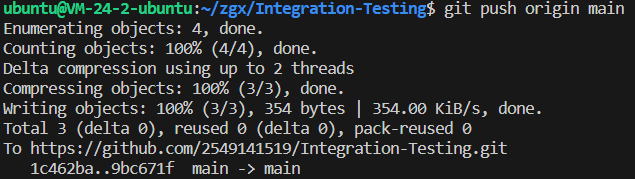
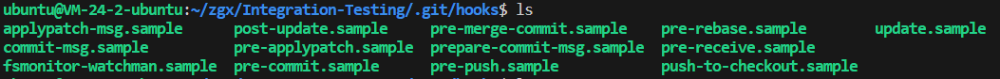
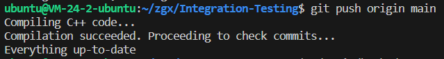
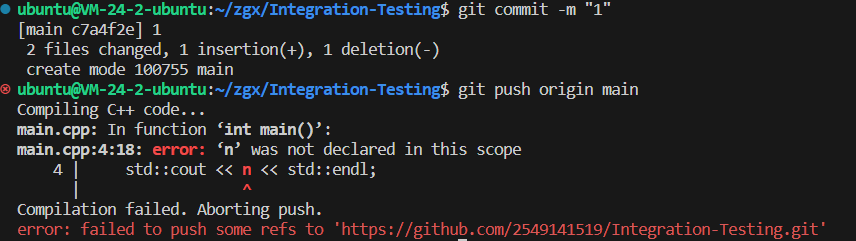
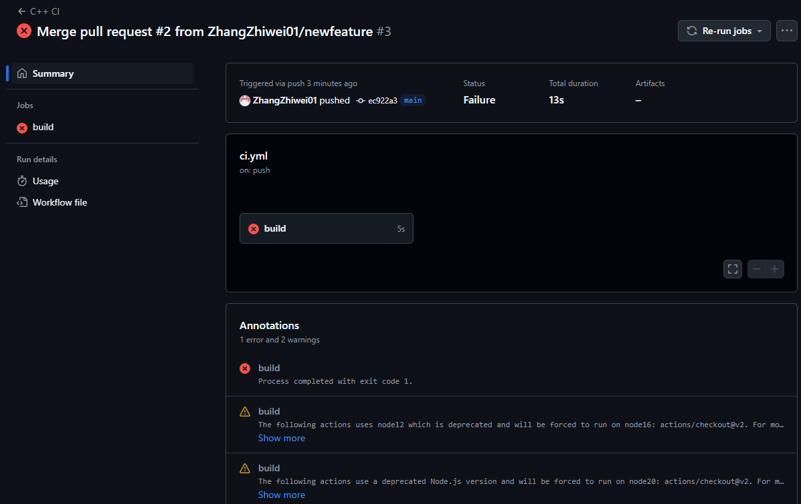

点击返回[🔗我的博客文章目录](https://2549141519.github.io/#/toc)
* 目录
{:toc}
<div onclick="window.scrollTo({top:0,behavior:'smooth'});" style="background-color:white;position:fixed;bottom:20px;right:40px;padding:10px 10px 5px 10px;cursor:pointer;z-index:10;border-radius:13%;box-shadow:0.5px 3px 7px rgba(0,0,0,0.3);"></div>

# 1. 集成测试
集成测试（Integration Testing）是一种软件测试方法，旨在验证不同模块或组件之间的交互是否按预期工作。集成测试关注多个模块或组件的组合和它们之间的接口。
修改github项目并提交（git push）时，会触发pre-push钩子，在pre-push钩子中，会执行集成测试，并判断是否通过。
本文编写了简单的集成测试，在项目提交时，集成测试会判断是否编译成功（c++），若不成功则提示编译失败，并阻止提交。
未修改pre-push钩子时，将不会执行集成测试：  
  

# 2. 集成测试的实现
## 2.1 编写c++文件，用于测试集成测试是否成功
代码如下：
>#include <iostream>  
int main() {  
    int n = 0;  
    std::cout << n << std::endl;  
    return 0;  
}  

## 2.2 编写pre-push钩子脚本，用于执行编译测试  
  

在项目根目录的.git/hooks中新建pre-push文件:
```
remote="$1"
url="$2"
# Step 1: 编译 C++ 代码
echo "Compiling C++ code..."
g++ -o main main.cpp
if [ $? -ne 0 ]; then
    echo "Compilation failed. Aborting push."
    exit 1
fi
echo "Compilation succeeded. Proceeding to check commits..."
# Step 2: 检查提交信息中是否包含 "WIP"
# 计算空内容的哈希值（用于检查是否是删除操作）
zero=$(git hash-object --stdin </dev/null | tr '[0-9a-f]' '0')
# 读取 git push 提供的本地和远程引用
while read local_ref local_oid remote_ref remote_oid
do
        if test "$local_oid" = "$zero"
        then
                # Handle delete
                :
        else
                if test "$remote_oid" = "$zero"
                then
                        # New branch, examine all commits
                        range="$local_oid"
                else
                        # Update to existing branch, examine new commits
                        range="$remote_oid..$local_oid"
                fi
                # Check for WIP commit
                commit=$(git rev-list -n 1 --grep '^WIP' "$range")
                if test -n "$commit"
                then
                        echo >&2 "Found WIP commit in $local_ref, not pushing"
                        exit 1
                fi
        fi
done
exit 0
```

编写完成后执行命令`chmod +x pre-push`，使文件具有可执行权限。

## 2.3 测试
测试时，在项目根目录下执行命令`git push origin main`，若编译成功，则提示推送成功，若编译失败，则提示编译失败，并阻止提交。  
成功时：  
  
此时修改main.cpp文件，将`int n = 0;`注释掉，并再次执行`git push origin main`，此时会提示编译失败，并阻止提交：    
  

# 3. 失败信息在pr中显示
想要在pr中显示失败信息，需要先修改pre-push钩子脚本，在集成测试不通过的情况下依然可以git push成功。  
在pre-push钩子脚本中，将`exit 1`改为`exit 0`，这样在集成测试不通过时，git push命令不会失败。  
此时进入项目根目录，新建.github/workflows/ci.yml文件，并添加以下内容：  
```
name: C++ CI

on:
  push:
    branches:
      - main
  pull_request:
    branches:
      - main

jobs:
  build:

    runs-on: ubuntu-latest

    steps:
    - uses: actions/checkout@v2

    - name: Set up C++ environment
      run: sudo apt-get install g++

    - name: Build C++ code
      run: g++ -o main main.cpp

    - name: Run the executable
      run: ./main
```

git push origin main后，创建新的pr，在pr中会显示集成测试的失败信息：  
  